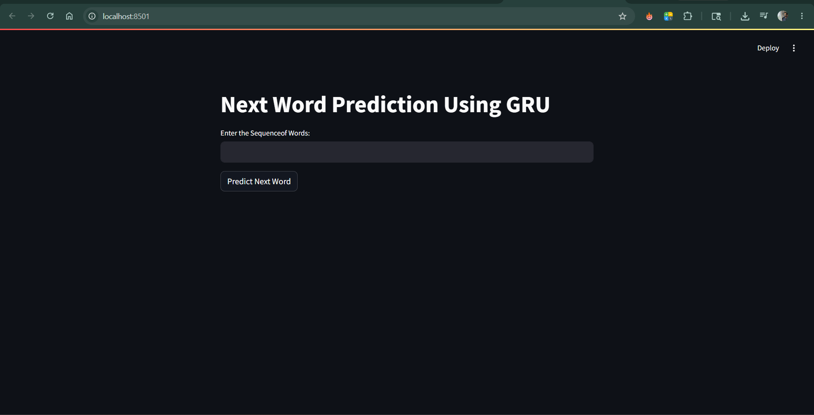
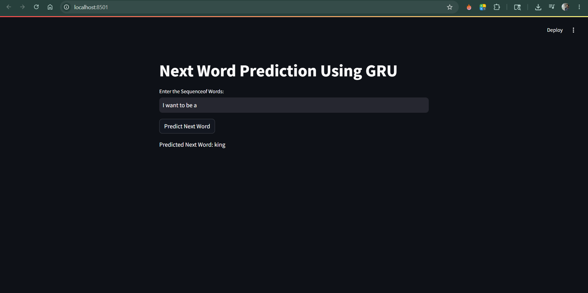

# GRU Next Word Prediction using Deep Learning

A deep learning based Next Word Prediction application built using TensorFlow, Keras, GRU, and Streamlit.  
The model learns text patterns from Shakespeare's Hamlet dataset and predicts the next probable word using Natural Language Processing (NLP) techniques.

---

## 🚀 Features

- Next word prediction using GRU (Gated Recurrent Unit)
- Deep Learning based NLP sequence modeling
- Trained on Shakespeare Hamlet text dataset
- Streamlit web application interface
- Tokenization and sequence preprocessing
- Temperature-based prediction randomness
- Model saving and loading using Keras

---

# Application Preview

## Home Page



---

## Prediction Output



## 🛠️ Technologies Used

- Python
- TensorFlow
- Keras
- NumPy
- Streamlit
- Scikit-learn
- Pickle

---

## 📂 Project Structure

```bash
LSTM_Project/
│
├── IMAGES/
│   ├── GRU_Home.png
│   └── GRU_Output.png
│
├── .gitignore
├── GRU_app.py
├── GRU_code.ipynb
├── gru_next_word_prediction_model.keras
├── LSTM_Code.ipynb
├── lstm_next_word_prediction_model.keras
├── prediction_app.py
├── README.md
├── requirements.txt
├── shakespeare_hamlet.txt
├── tokenizer_GRU.pickle
└── tokenizer.pickle